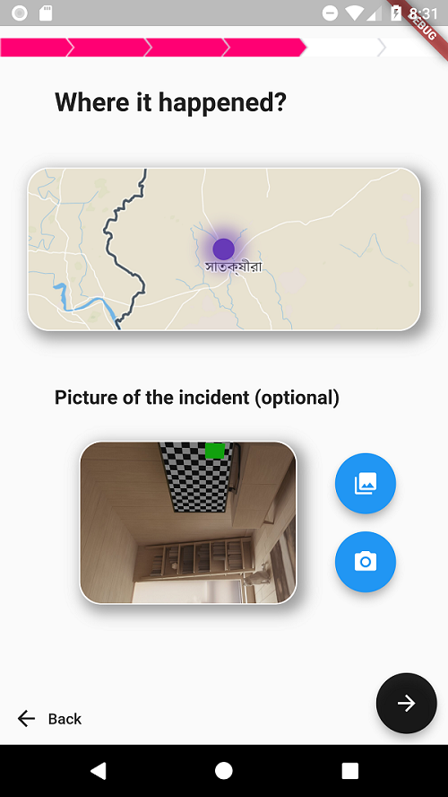

# location and image picker package for Flutter

[](https://pub.dartlang.org/packages/location_and_image_picker)

A Flutter package for iOS and Android for picking location and images.
## Demo



## Installation

First, add `location_and_image_picker` as a [dependency in your pubspec.yaml file](https://flutter.io/platform-plugins/).

### iOS

Add the following keys to your _Info.plist_ file, located in `<project root>/ios/Runner/Info.plist`:

On iOS you'll need to add the `NSLocationWhenInUseUsageDescription` to your Info.plist file in order to access the device's location. Simply open your Info.plist file and add the following:

``` xml
<key>NSLocationWhenInUseUsageDescription</key>
<string>This App Need Your Current Location Permission </string>
<key>NSCameraUsageDescription</key>
<string>Used to demonstrate image picker plugin</string>
<key>NSMicrophoneUsageDescription</key>
<string>Used to capture audio for image picker plugin</string>
<key>NSPhotoLibraryUsageDescription</key>
<string>Used to demonstrate image picker plugin</string>
```


### Android

On Android you'll need to add either  the `ACCESS_FINE_LOCATION` permission to your Android Manifest. Todo so open the AndroidManifest.xml file and one of the following two lines as direct children of the `<manifest>` tag:

``` xml
<uses-permission android:name="android.permission.INTERNET" />
<uses-permission android:name="android.permission.ACCESS_FINE_LOCATION" />
```

### Code for the location and image picker widget

``` dart
import 'package:location_and_pic_picker/location_and_pic_picker.dart';

class MyHomePage extends StatefulWidget {
  @override
  _MyHomePageState createState() => _MyHomePageState();
}

class _MyHomePageState extends State<MyHomePage> {
 Map<String, String> _getValue = new Map();
 
  @override
  Widget build(BuildContext context) {
    return LocationAndPicPicker(
                           onChanged: getLocationAndPic,
                         );
  }
  void getLocationAndPic(Map value) {
      _getValue = value;
    }
}
```

### Code for the Full page location and image picker widget

``` dart
import 'package:location_and_pic_picker/fullpage_location_and_pic_picker.dart';

class HomePage extends StatelessWidget {
  final Map mapData;
  const PageFive({Key key, this.mapData}) : super(key: key);

  @override
  Widget build(BuildContext context) {
    return FullPageLocationAndImagePicker(      
      mapData: mapData,
      title: "Where it happened?",
      route: "/secend",
    );
  }
}
```
